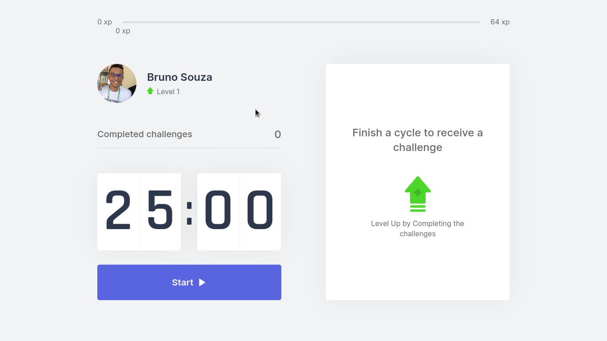
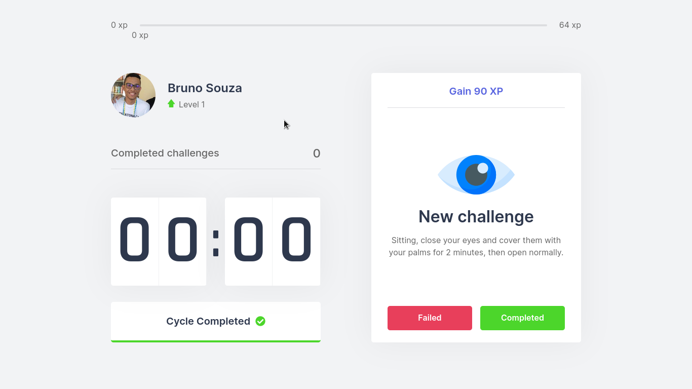
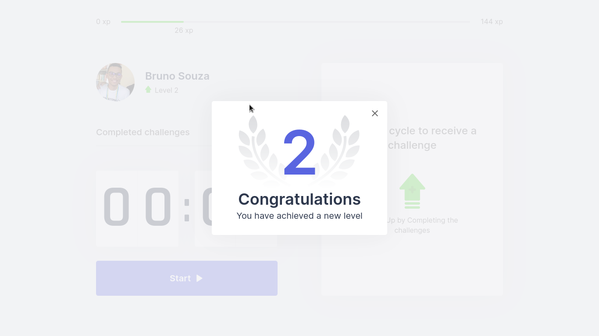

<h1 align="center">
    
</h1>

<h3 align="center"> A funny way to improve your health
</h3>

<p align="center">
  

  

  <a href="https://github.com/arubesu/move-it-next/commits/master">
    
  </a>
    

   
</p>


<p align="center">
 <a href="#about">About</a> •
 <a href="#features">Features</a> •
 <a href="#layout">Layout</a> •
 <a href="#how-it-works">How it works</a> •
 <a href="#tech-stack">Tech Stack</a> •
 <a href="#author">Author</a> •
 <a href="#license">License</a>
</p>


## About

🧘 Move.It  is a funny way to improve your health. Complete challenges after time ends to receive experience and level up.
Project developed during  NLW - Next Level Week  offered by [Rocketseat](https://blog.rocketseat.com.br/). NLW is an online experience with lots of practical content, challenges and hacks where the content is available for a week.

---

## Features

- [x] Keep on focus for a time and when the time ends complete the challenge to gain experience. 
- [x] Leave the cycle.
---

## Layout

The application layout is available on Figma:

<a href="https://www.figma.com/file/6UgOfcxDDZkH6quKQFnWx1/Move.it-1.0-(Copy)?node-id=160%3A2761">
  
</a>

<p align="center" style="display: flex; align-items: flex-start; justify-content: center;">
 

 

 

---

## How it works
You need to stay focused for a certain time, when time ends you will be challenged and you should answer whether or not you have completed the challenge to gain experience.

### Pre-requisites

Before you begin, you will need to have the following tools installed on your machine:
[Git] (https://git-scm.com), [Node.js] (https://nodejs.org/en/).
In addition, it is good to have an editor to work with the code like [VSCode] (https://code.visualstudio.com/)

#### Running the web application

```bash

# Clone this repository
$ git clone git@github.com:arubesu/move-it-next.git

# Access the project folder cmd/terminal
$ cd move-it-next

# install the dependencies
$ npm install

# Run the application in development mode
$ npm run dev

# The application will start at port: 3000 - go to http://localhost:3000/

```
---

## Tech Stack

The following tools were used in the construction of the project:

#### **Website**  ([NEXT js](https://nextjs.org/) ) with ([Typescript](https://www.typescriptlang.org/))

-   **[React](https://reactjs.org/)**
-   **[js cookie](https://github.com/js-cookie/js-cookie)**

> See the file  [package.json](https://github.com/arubesu/move-it-next/blob/master/package.json)

#### **Tools**

-   Prototype:  **[Figma](https://www.figma.com/)**  →  **[Layout (Move.It)](https://www.figma.com/file/6UgOfcxDDZkH6quKQFnWx1/Move.it-1.0-(Copy)?node-id=160%3A2761)**
---
## How to contribute

1. Fork the project.
2. Create a new branch with your changes: `git checkout -b my-feature`
3. Save your changes and create a commit message telling you what you did: `git commit -m" feature: My new feature "`
4. Submit your changes: `git push origin my-feature`
> If you have any questions check this [guide on how to contribute](https://github.com/firstcontributions/first-contributions)

---

## Author

 
 <br />

 [](https://www.linkedin.com/in/bruno-a-souza/)
---

## License

This project is under the license [MIT](./LICENSE).

Made with ❤️  by Bruno Souza 👋🏽 [Get in Touch!](https://www.linkedin.com/in/bruno-a-souza/)
